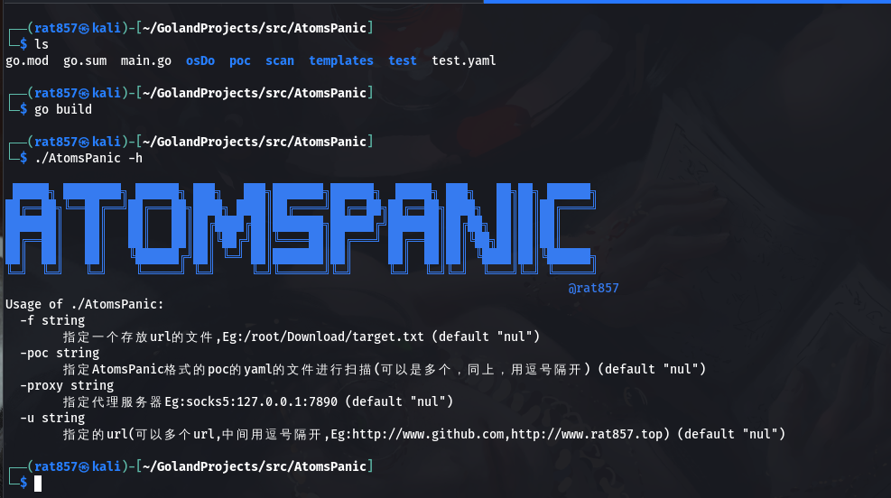
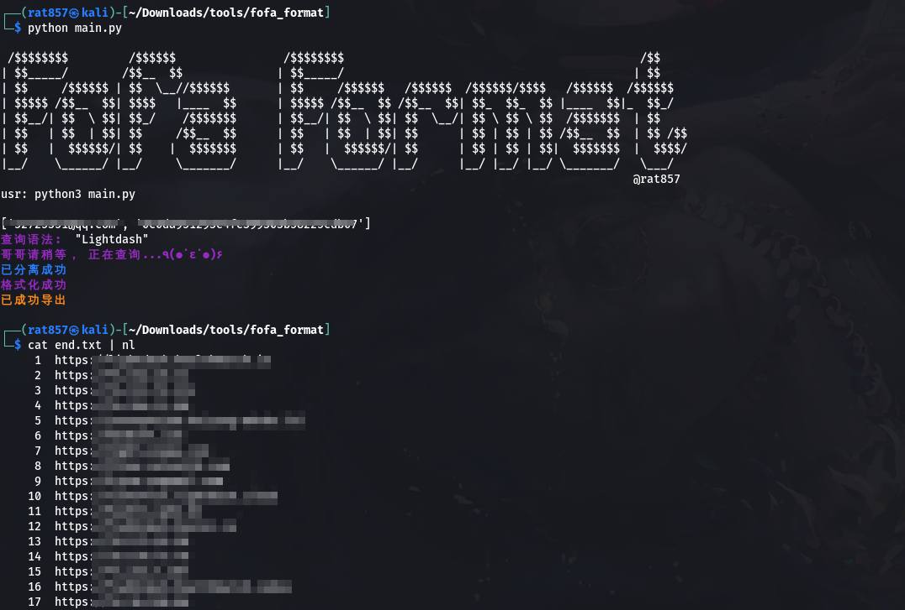
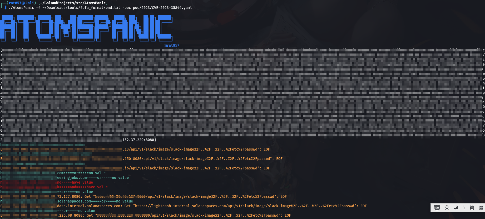

# AtomsPanic
GoPanic重构版
## 基于yaml的扫描框架
### yaml文件编写方法
```yaml
id: test
info:
  name: Apache Struts2 S2-008 RCE
  severity: high
  type: SQL注入
  search-engine:
  - fofa: app=\"通达OA网络智能办公系统\"
  - shodan: windows7
  link:
  - http://wiki.peiqi.tech/wiki/serverapp/VMware/VMware%20Workspace%20ONE%20Access%20SSTI%E6%BC%8F%E6%B4%9E%20CVE-2022-22954.html
  - http://wiki.peiqi.tech/wiki/cms/DocCMS/DocCMS%20keyword%20SQL%E6%B3%A8%E5%85%A5%E6%BC%8F%E6%B4%9E.html
http:
  logic: and
  Packets:
  - method: GET
    path: /?M_id=1%27&type=product
    head:
      Type: gettype
      User-Agent: justdo
    body: ""
    matchers:
      regex-logic: and
      regex:
      - success
      - status
      - "200"
  - method: POST
    path: /1.php
    head:
      Type: posttype
      User-Agent: justdo
    body: passwd=123.com
    matchers:
      regex-logic: ""
      regex:
      - "200"
```
主要关注http:后面的，http.logic是如果有两个及两个以上的数据包时，这两个数据包的逻辑关系
http.packets是数据包的信息，其中的matchers是验证方面的，目前，只写了验证响应包body字段的方法,matchers.regex就是要验证响应包里的关键字，如果有该关键字就是true，matchers.regex-logic是你写的关键字的逻辑关系

## AtomsPanic用法
```shell
git clone https://github.com/rat857/AtomsPanic.git
cd AtomsPanic
go build
./AtomsPanic -h
```

### 可以配合[fofa-format](https://github.com/rat857/fofa_format)使用,poc里有fofa语法
Eg:(CVE-2023-35844)


扫描完成后会自动创建一个goot.txt,有漏洞的url会保存在里面
